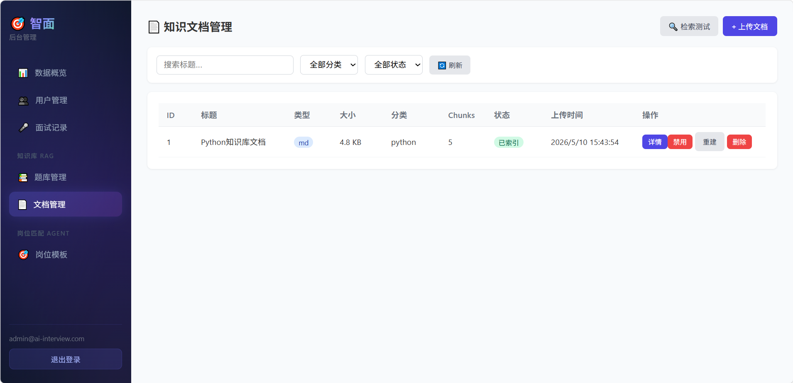
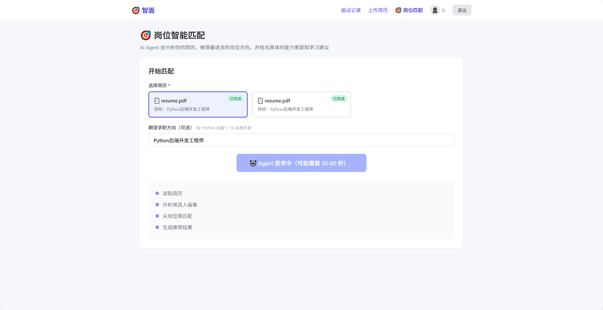
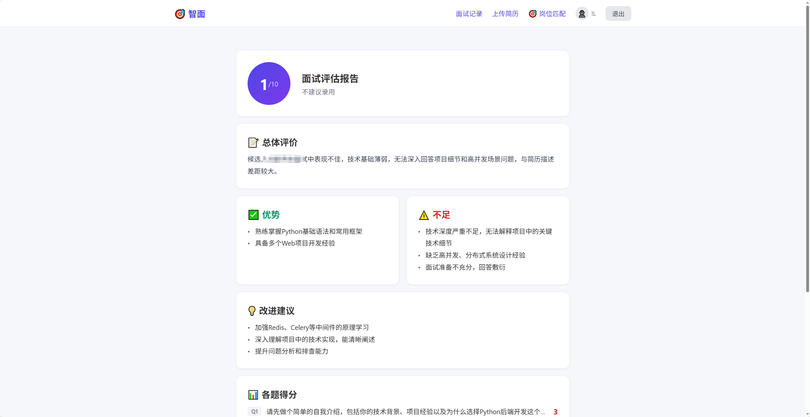

# AI Interview Agent

一个面向求职训练场景的 AI 模拟面试系统，覆盖「简历解析、岗位匹配、题库 RAG 出题、AI 评分、面试报告」完整流程。项目采用前后端分离架构，后端通过 Docker Compose 编排 FastAPI、PostgreSQL、Redis、Celery 等服务，前端提供用户端和管理端两个入口。

## 功能概览

- 用户端：注册登录、简历上传、简历解析、岗位匹配、模拟面试、报告查看
- 管理端：题库管理、题库导入、题库向量化、知识库上传、岗位模板管理、面试记录查看
- AI 能力：OpenAI-compatible Chat API、DashScope Embedding、LangChain Agent、RAG 召回与评分
- 工程能力：Docker Compose、本地文件存储、异步任务、数据库迁移、服务健康检查

## 技术栈

后端：

- FastAPI
- SQLAlchemy 2.x
- Alembic
- PostgreSQL + pgvector
- Redis
- Celery
- Uvicorn

AI / RAG / Agent：

- OpenAI-compatible SDK
- Qwen / DeepSeek 等兼容模型
- DashScope Embedding
- LangChain
- pgvector cosine similarity

前端：

- Vue 3
- Vite
- Vue Router
- Pinia
- Axios

部署：

- WSL / Ubuntu / Linux
- Docker
- Docker Compose

## 系统架构

```text
[用户端 Vue]
   ├─ 简历上传
   ├─ 岗位匹配
   ├─ 模拟面试
   └─ 面试报告
        │
        ▼
[FastAPI Backend]
   ├─ Auth / User
   ├─ Resume Service
   ├─ Position Agent
   ├─ Interview Service
   ├─ Question Bank RAG
   └─ Knowledge Base
        │
        ├─ LLM Provider: 简历解析 / 出题 / 评分 / 报告
        ├─ DashScope: Embedding
        ├─ PostgreSQL + pgvector: 结构化数据与向量检索
        ├─ Redis: 缓存与消息队列
        └─ Celery: 异步任务

[管理端 Vue]
   ├─ 题库管理
   ├─ 知识库管理
   ├─ 岗位模板
   └─ 面试记录
```

## 核心流程

### 1. 简历解析

用户上传 PDF 简历后，后端提取文本并调用大模型生成结构化简历信息，同时保存简历分析结果，为后续岗位匹配和面试出题提供上下文。

### 2. 岗位匹配 Agent

岗位匹配不是简单表单跳转，而是通过工具调用工作流完成：

- 获取结构化简历
- 构建候选人画像
- 读取岗位模板
- 计算匹配方向
- 输出推荐岗位、理由、能力差距和学习建议

### 3. 题库 RAG 出题

管理员维护结构化题库，每道题包含题目、参考答案、采分点、岗位标签和难度。系统向量化题库后，在面试开始时结合岗位与简历技能生成 query，通过 pgvector 做语义召回，再由模型筛选和微调题目。

### 4. AI 评分与报告

评分阶段会把用户回答、参考答案、采分点注入评分 Prompt，减少纯模型自由评分的不稳定性。面试结束后生成结构化报告，包括综合评价、薄弱点和学习建议。

## 项目结构

```text
.
├─ ai-interview-backend/      # FastAPI + PostgreSQL + Redis + Celery
├─ ai-interview-frontend/     # 用户端前端
├─ ai-interview-admin/        # 管理端前端
├─ 题库和知识库文档（用于后台上传）/
├─ 项目截图/
├─ 部署教程.md
├─ 面试要点.md
└─ 项目RAG实现原理.md
```

## 本地启动

### 1. 后端

```bash
cd ai-interview-backend
cp .env.example .env
```

编辑 `.env`，填入模型和 embedding 服务配置：

```env
DEEPSEEK_API_KEY=your-llm-api-key
DEEPSEEK_BASE_URL=https://dashscope.aliyuncs.com/compatible-mode/v1
DEEPSEEK_MODEL=qwen-plus
DASHSCOPE_API_KEY=your-dashscope-api-key
```

启动服务：

```bash
docker compose -f docker-compose.yml -f docker-compose.dev.yml up -d --build
docker exec ai-interview-app alembic upgrade head
docker exec ai-interview-app python scripts/create_first_admin.py
docker exec ai-interview-app python scripts/seed_position_templates.py
```

健康检查：

```bash
curl http://localhost:8006/api/v1/config/health
```

### 2. 用户端

```bash
cd ai-interview-frontend
npm install
npm run dev
```

访问：

```text
http://localhost:3000
```

### 3. 管理端

```bash
cd ai-interview-admin
npm install
npm run dev
```

访问：

```text
http://localhost:3001
```

默认管理员账号：

```text
admin@ai-interview.com
ai-interview&admin
```

## 面试演示路径

推荐演示顺序：

1. 打开管理端，展示岗位模板和题库结构。
2. 导入题库 JSON，并执行向量化。
3. 上传知识库文档，说明 chunk 切分、embedding、pgvector 存储。
4. 打开用户端，注册/登录并上传简历。
5. 执行岗位匹配，展示 Agent 的推荐结果。
6. 发起模拟面试，展示 RAG 出题和 AI 评分。
7. 生成面试报告，讲解评分依据与改进建议。

## 可讲解的技术点

- 为什么使用 PostgreSQL + pgvector，而不是单独引入向量数据库
- 题库 RAG 如何结合岗位标签、简历技能和语义相似度做召回
- 评分为什么注入参考答案和采分点，避免模型主观打分
- Celery 在知识库向量化、异步任务中的作用
- 前后端如何通过 Vite proxy 与 Docker 后端联调
- 如果扩展到生产环境，如何处理鉴权、日志、队列监控、对象存储和 CI/CD

## 截图








## 后续优化方向

- 增加单元测试和接口测试覆盖率
- 给 Celery Worker 增加独立健康检查
- 增加模型调用失败时的降级策略和重试策略
- 接入对象存储保存简历和附件
- 增加管理端数据看板和任务队列监控
